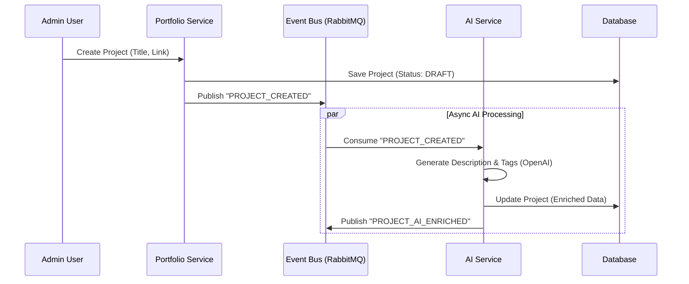

# Enterprise Event-Driven Architecture

## Overview

This platform uses a **Modular Monolith** architecture powered by **Event-Driven Design (EDA)**.
The core principle is that every significant action emits an event, which is then consumed by other modules to perform side effects (AI enrichment, Notifications, Analytics, etc.).

## Core Components

1.  **Event Bus (RabbitMQ)**: The central nervous system.
2.  **PostgreSQL (Prisma)**: The primary data store (Event Store + Read Models).
3.  **Modules**: Self-contained domains (Portfolio, AI, Auth, etc.).
4.  **Next.js App Router**: The UI layer that interacts with Modules via Server Actions.

## Domain Boundaries

### 1. Portfolio Module (`src/modules/portfolio`)
- **Responsibilities**: Manage Projects, Categories, Tags.
- **Commands**: `CreateProject`, `UpdateProject`, `PublishProject`.
- **Events**: `PROJECT_CREATED`, `PROJECT_UPDATED`.

### 2. AI Module (`src/modules/ai`)
- **Responsibilities**: Generative AI tasks.
- **Listeners**: Listens to `PROJECT_CREATED`, `BLOG_CREATED`.
- **Actions**: Generates summaries, SEO tags, checks grammar.
- **Events**: `PROJECT_AI_ENRICHED`.

### 3. Auth Module (`src/modules/auth`)
- **Responsibilities**: Identity & Access Management.
- **Provider**: GitHub OAuth (via NextAuth).
- **Events**: `USER_LOGIN`, `USER_REGISTERED`.

## Event Flow Example: Creating a Project



## Directory Structure

```
src/
├── app/                 # Next.js App Router (UI)
├── modules/             # Domain Logic
│   ├── core/            # Shared DDD building blocks
│   ├── portfolio/       # Portfolio Domain
│   └── ai/              # AI Domain
├── infrastructure/      # Technical Services
│   ├── db/              # Prisma Setup
│   └── event-bus/       # RabbitMQ Implementation
└── lib/                 # Utils
```

## Event Schema Registry

All events follow the `CloudEvents` or similar standard structure:

```json
{
  "eventId": "uuid",
  "eventType": "PROJECT_CREATED",
  "timestamp": "ISO-8601",
  "payload": {
    "projectId": "123",
    "title": "My New App",
    "githubUrl": "..."
  },
  "metadata": {
    "actorId": "user_456",
    "correlationId": "xyz"
  }
}
```
